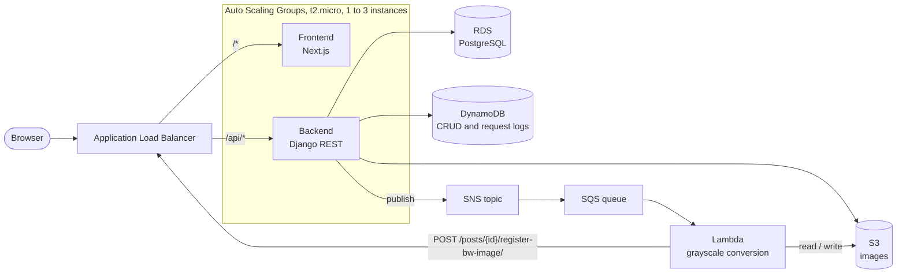

# Photo Feed on AWS

An Instagram-style photo feed (called Nuvem in the UI): users sign up, post pictures with a caption, and a background job produces a black-and-white copy of each image.

The app itself is small on purpose. The point of the project is the infrastructure around it. I built the same app twice to compare the two ways of running it: this version uses managed AWS services (EC2, RDS, S3, DynamoDB, SNS/SQS, Lambda) behind a load balancer with auto scaling, all provisioned with Terraform. The other version, in the [`photo-feed-selfhosted`](https://github.com/matheustguimaraes/photo-feed-selfhosted) repository, replaces the managed services with containers I run myself (MinIO, RabbitMQ, Celery, Postgres).

## Architecture



Upload flow:

1. The frontend creates the post (`POST /api/posts/`) and then uploads the image (`POST /api/posts/{id}/upload-image/`).
2. The backend stores the original under `private/` in S3, saves the key on the post and publishes a message to SNS.
3. SNS fans out to SQS, which triggers the Lambda function.
4. The Lambda downloads the original, converts it to grayscale with Pillow, writes `<name>_bw.<ext>` back to S3 and calls the backend with a shared service token so the post points to the new image.
5. Every create, read, update and delete, plus every authenticated request, is written to DynamoDB with the action type, payload, user and timestamp.

Scaling rules: start with one instance; add one when average CPU stays above 70% for a minute; remove one when it stays below 25% for a minute; never more than three.

## Stack

| Layer | Technology |
| --- | --- |
| Frontend | Next.js 16 (App Router), React 19, TypeScript, Tailwind CSS 4, TanStack Query |
| Backend | Django 5.2, Django REST Framework, SimpleJWT, drf-yasg (Swagger) |
| Relational database | PostgreSQL on Amazon RDS |
| File storage | Amazon S3 via django-storages |
| Logs | Amazon DynamoDB |
| Messaging | Amazon SNS + SQS |
| Image processing | AWS Lambda (Python 3.11, Pillow) |
| Compute | EC2 Auto Scaling Groups behind an Application Load Balancer, images in ECR |
| Infrastructure | Terraform |

## Repository layout

```text
backend/                   Django API (posts, profiles, auth, DynamoDB logging)
frontend/                  Next.js app (feed, post pages, profile, login/register)
lambda_image_processing/   Lambda handler and a Dockerfile that builds the deployment zip
terraform/                 VPC, ALB, ASGs, RDS, S3, DynamoDB, SNS/SQS, Lambda, ECR, IAM
scripts/                   Build the Lambda zip, push images to ECR, push Terraform state to S3
docker-compose.yaml        Local stack
```

## Running locally

Requirements: Docker and Docker Compose. Uploads go to S3 and logs go to DynamoDB, so you need an AWS account with a bucket and a table (or set `DEBUG_MODE=true` to skip the DynamoDB writes).

```bash
cp backend/.env.example backend/.env
cp frontend/.env.example frontend/.env
# fill in the AWS values in backend/.env

docker compose up --build
```

- Frontend: <http://localhost:3000>
- API: <http://localhost:8000/api/>
- Swagger: <http://localhost:8000/api/swagger/>
- RabbitMQ management: <http://localhost:15672> (admin / admin)

The compose file still starts the RabbitMQ thumbnail worker (`python manage.py process_images`) from an earlier iteration. On AWS the processing path is SNS, SQS and Lambda, so black-and-white images only show up once those are deployed and `SNS_TOPIC_ARN` is set.

Without Docker:

```bash
cd backend
python -m venv venv && source venv/bin/activate
pip install -r requirements.txt
python manage.py migrate
python manage.py runserver

cd ../frontend
npm install
npm run dev
```

## Deploying to AWS

```bash
# 1. Build the Lambda package (writes terraform/lambda_image_processing.zip)
./scripts/build-lambda.sh

# 2. Provision the infrastructure
cd terraform
cp terraform.tfvars.example terraform.tfvars   # set db_password, bucket name, keys, token
terraform init
terraform apply

# 3. Build and push the frontend and backend images to ECR
cd ..
AWS_ACCOUNT_ID=<account id> AWS_PROFILE=<profile> ./scripts/ecr-push-codebases.sh
```

The launch templates pull the `latest` images from ECR when an instance boots, so a new push only reaches existing instances after they are replaced (for example with an instance refresh). `terraform output` prints the load balancer URL.

`terraform/cleanup-resources.sh` empties the ECR repositories and the S3 bucket so `terraform destroy` can remove them.

## API

All routes are under `/api/`. Authentication uses JWT bearer tokens.

| Method | Route | Description |
| --- | --- | --- |
| POST | `/auth/register/` | Create a user and an empty profile |
| POST | `/auth/token/` | Get an access and refresh token |
| POST | `/auth/token/refresh/` | Refresh the access token |
| GET, PATCH | `/auth/profile/` | Read or update the profile (age, course, city) |
| GET, POST | `/posts/` | List the user's posts or create one |
| GET, PATCH, DELETE | `/posts/{id}/` | Read, edit or delete a post |
| POST | `/posts/{id}/upload-image/` | Upload the image and queue processing |
| POST | `/posts/{id}/register-bw-image/` | Called by the Lambda with `X-Service-Token` |

## Trade-offs

Things I left simple on purpose to keep the scope small:

- CSRF middleware is off and CORS allows any origin, since the API only takes JWTs.
- The backend and Lambda talk through a shared token instead of IAM auth.
- AWS credentials are passed to the containers as environment variables; an instance role would be the better choice.
- The Django dev server runs in the containers instead of Gunicorn.
